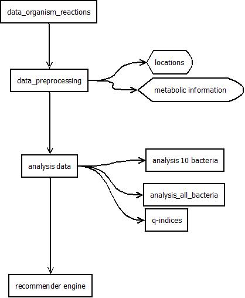

## Overview workflow

## The Data

How the data was retrieved can be found in [data_organism_reactions](./data_organism_reactions)

## The preprocessing
The data was preprocessed in the folder [data_preprocessing](./data_preprocessing).

## Analysis of the data
The data was analysed in the [analysis_data](./analysis data)

## Recommender engine
Finally a simple [recommender engine](./recommender_engine) was implemented.

